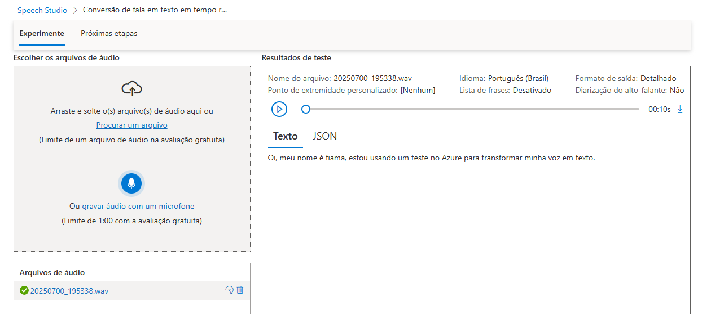
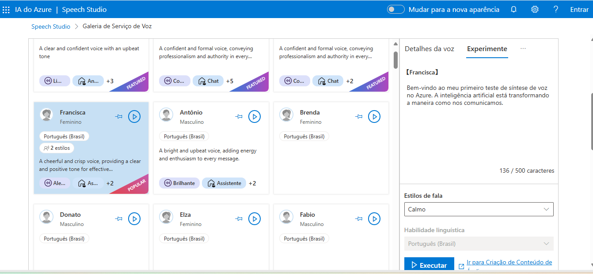
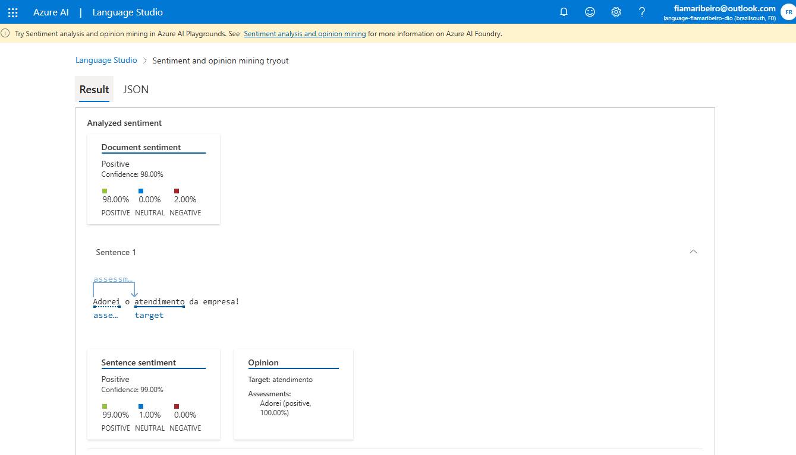
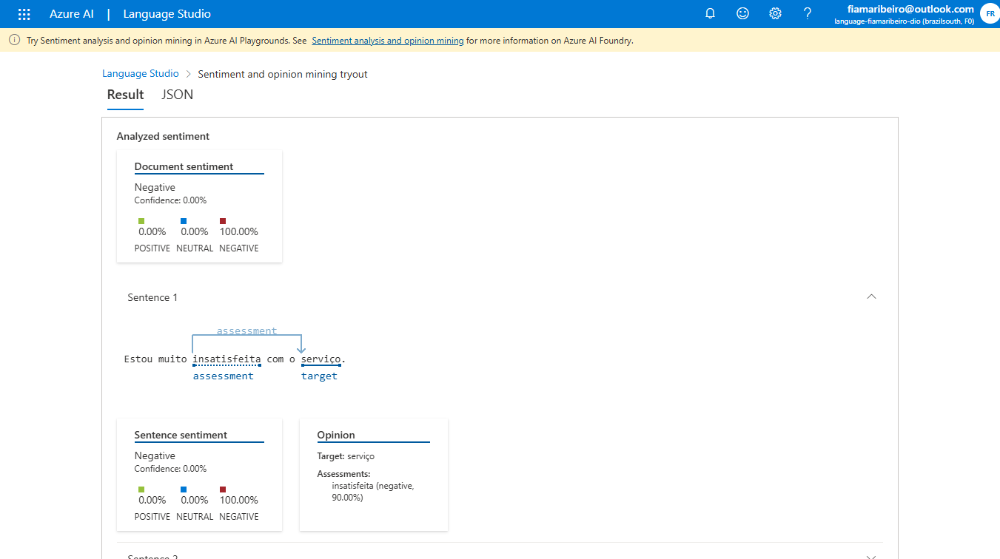
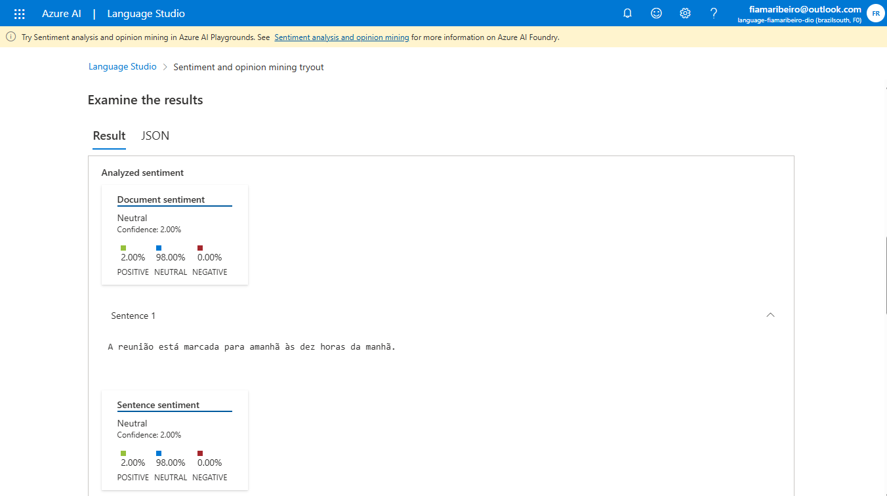
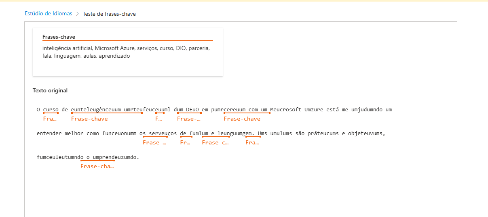
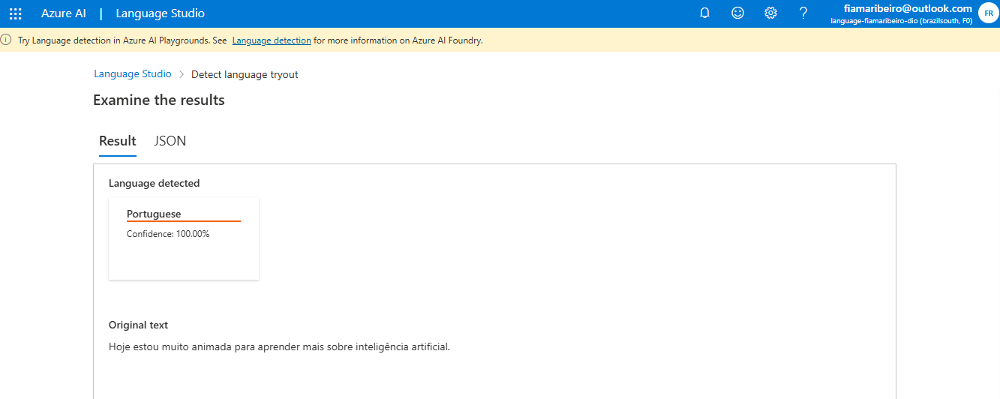
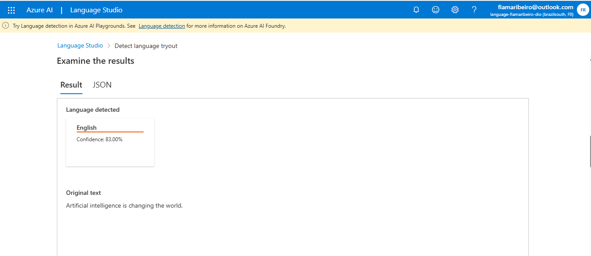
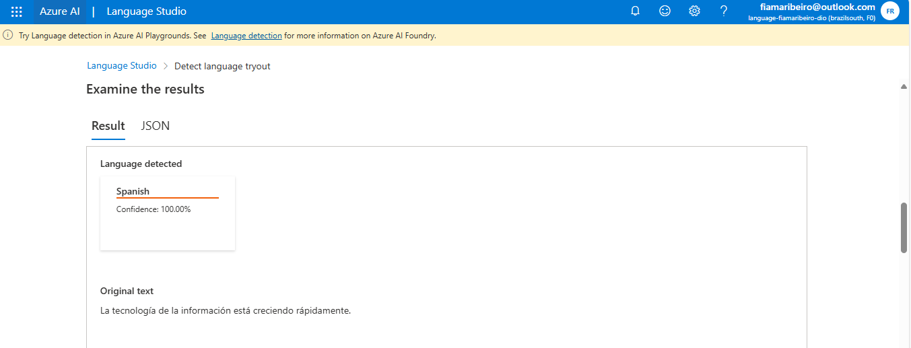

---

## 🎙️ Speech Studio

### 🔹 Speech-to-Text
Convertemos áudio em texto.  

### 🔹 Text-to-Speech
Geramos voz neural a partir de texto.  

---

## 📝 Language Studio

### 🔹 Análise de Sentimento
- **Positivo**  

- **Negativo**  

- **Neutro**  

### 🔹 Extração de Palavras-chave

### 🔹 Detecção de Idioma
  
  

---

## 💡 Insights
- Áudios curtos e ambiente silencioso melhoram a acurácia do STT.  
- As vozes neurais **pt-BR** do TTS soam muito naturais.  
- O *Sentiment Analysis* funciona bem em textos curtos e objetivos.  
- A extração de *Key Phrases* ajuda a resumir feedbacks.  
- A detecção de idioma tem alta confiabilidade (100% nos testes PT, EN, ES).

---

## 🔗 Referências
- [Microsoft Speech Studio](https://speech.microsoft.com/)  
- [Microsoft Language Studio](https://language.cognitive.azure.com/)  
- [Documentação oficial Azure AI](https://learn.microsoft.com/azure/cognitive-services/)

---

## 🚀 Entrega
Repositório desenvolvido como parte do desafio da [Digital Innovation One](https://www.dio.me/).
# dio-azure-speech-language
